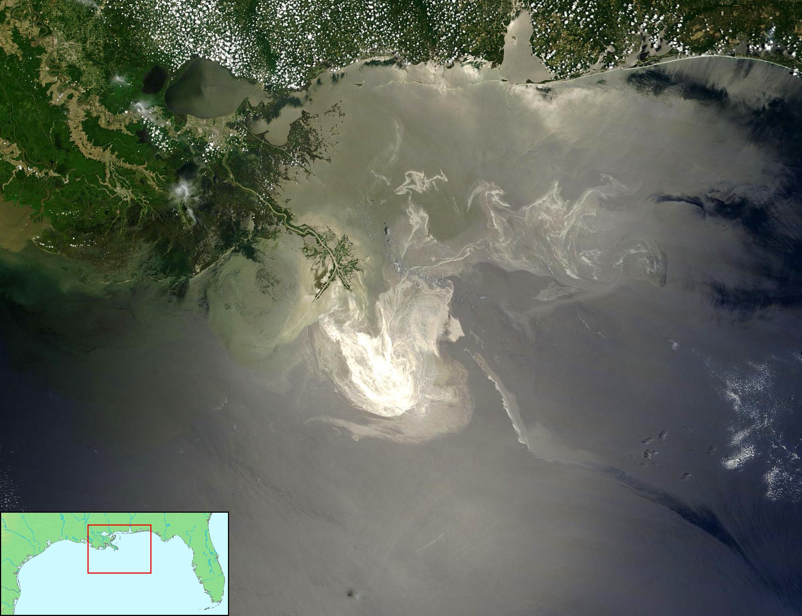
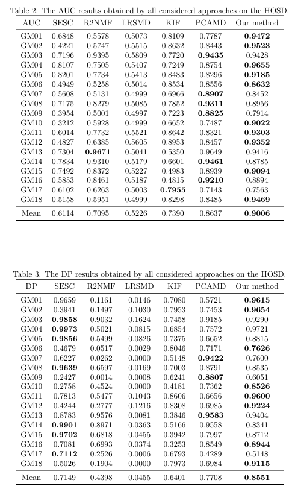
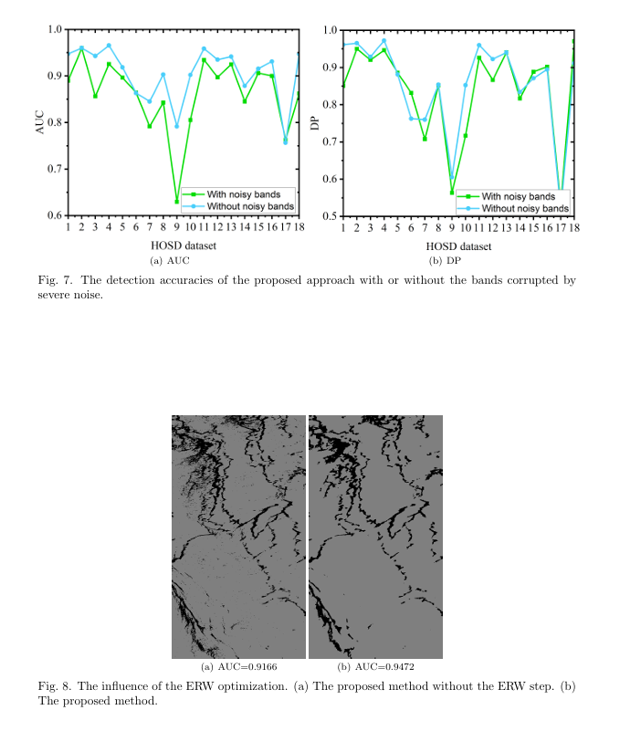
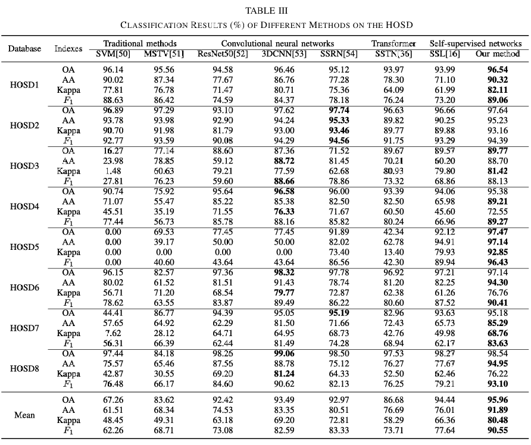
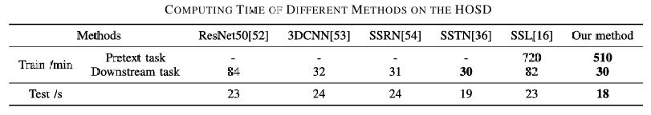

# Paper List
These papers below use the same general type of hyperspectral dataset (HOSD: 1, 2, 3. Similar but different world location: 4). The HOSD dataset is not a simulation (eg, the researchers mix their own oil in a lab). There are a few more papers that use hyperspectral cameras but are simulated (5, 6)

*Cited with APA 7*

[1] Duan, P., Kang, X., Ghamisi, P., & Li, S. (2023). Hyperspectral remote sensing benchmark database for oil spill detection with an isolation forest-guided unsupervised detector. IEEE Transactions on Geoscience and Remote Sensing, 61, 1-11.

[2] Kang, X., Deng, B., Duan, P., Wei, X., & Li, S. (2023). Self-supervised spectral–spatial transformer network for hyperspectral oil spill mapping. IEEE Transactions on Geoscience and Remote Sensing, 61, 1-10.

[3] Samkhaniani, M., Khoshand, A., & Ezati, S. (2026). Deep learning-based hyperspectral oil spill detection for marine pollution monitoring in the Gulf of Mexico: A step toward marine pollution monitoring and SDG 14 compliance. Marine Pollution Bulletin, 222, 118908.

[4] Yang, J., Wang, J., Hu, Y., Ma, Y., Li, Z., & Zhang, J. (2023). Hyperspectral marine oil spill monitoring using a dual-branch spatial–spectral fusion model. Remote Sensing, 15(17), 4170.

[5] Carrasco-García, M. G., Rodríguez-García, M. I., González-Enrique, J., Ruiz-Aguilar, J. J., & Turias-Domínguez, I. J. (2023). Hyperspectral technology for oil spills characterisation by using feature selection. Transportation Research Procedia, 71, 117-123.

[6] Carrasco-García, M. G., Rodríguez-García, M. I., Ruíz-Aguilar, J. J., Deka, L., Elizondo, D., & Turias Domínguez, I. J. (2024). Oil spill classification using an autoencoder and hyperspectral technology. Journal of Marine Science and Engineering, 12(3), 495.

## [1] Hyperspectral Remote Sensing Benchmark Database for Oil Spill Detection with an Isolation Forest-Guided Unsupervised Detector
This paper is the source of our main HOSD dataset. They wanted to develop a way to generate accurate ground truth samples for oil spill because manual labelling requires a lot of effort. To be able to compare their labelling method, they had "field experts" label "pixel by pixel" using Environment for Visualizing Images (ENVI) software. In the end, they showed their unsupervised oil spill detection method that uses "both the spectral and spatial information of oil spill regions" to automatically generate training samples for the spectral classifier.

### Data Information
#### Data Source
Gulf of Mexico oil spill with AVIRIS sensor. NASA provided AVIRIS images. The spectral coverage is from 365nm to 2500nm. Due to different altitudes in different routes, the spatial resolution of images vary.

#### Preprocessing
There are many preprocessing levels for data in general, such as:

0 - Raw Data

1 - Radiance

1A - Radiance

1B - Radiance, Sensor Coordinates

2 - Geophys. Variables, Sensor Coordinates

3 - Gridded Observations

4 - Gridded Model Output

5 - Non of the above

The HOSD dataset aligns most with *2 - Geophys. Variables* because it was converted to surface reflectance before the authors applied their algorithm: "These datasets have been processed with an atmospheric correction model in ENVI 5.3 software before oil spill detection, where the Fast Line-of-Sight Atmospheric Analysis of Spectral Hypercube (FLAASH) is adopted."

#### Training Method
Noisy Band Removal: "A Gaussian statistical-based method is developed to automatically remove the bands corrupted by serious noise."

Dimensionality Reduction: "The kernel principal component analysis (KPCA) is employed to reduce the high dimensionality of the HSIs."

Probability Estimation: "The isolation forest is employed to detect the probability of each pixel belonging to the oil film and the seawater..."

Pseudo-Label Generation: "...an efficient k-means algorithm is performed on the probability map $p$ to generate the training samples."

Initial Classification: "1% of the whole training samples are randomly selected... The training set is fed into the SVM classifier to yield the initial detection map." Not all data is used because SVM is too slow to process the millions of free labels its algorithm generates.

Spatial Optimization: "The ERW [extended random walker] algorithm is utilized to optimize the initial detection map by integrating the spatial information so as to produce the final result."

#### Recommended Detection Metrics
The paper suggests these two main metrics that are good for anomaly detection.

ROC Curve: The probability that a classifier will rank a randomly chosen positive instance higher than a randomly chosen negative instance. 

Precision: True positive rate over all positive predictions.

#### Results
"The satisfactory detection results obtained by the proposed method are mainly due to several reasons: First, the noisy band removal can effectively alleviate the interference of severe noisy bands to detection performance. This step is able to greatly boost the robustness of the proposed method. Second, the isolation forest method produces relatively true training samples, even though it does not involve human annotation. Third, the ERW-based optimization process takes full advantage of the spatial correlations among neighboring pixels. This optimization is beneficial for improving the detection accuracy."

#### Ablations

## [2] Self-Supervised Spectral–Spatial Transformer Network for Hyperspectral Oil Spill Mapping
This paper, though by the same authors of the main dataset, has a bit of a different goal. This time, it is multi-class classification (thick oil/thin oil/sheen/seawater) of the same type of data using the same sensor and same disaster (but not exact same dataset). They also mention that the main HOSD proposal paper has limitations of the method depending a lot on the selection of bands which are "often very complicated and time-consuming".

#### Data Source
Gulf of Mexico oil spill with AVIRIS sensor. NASA provided AVIRIS images. The spectral coverage is from 365nm to 2500nm. 8 images of 500 × 350 pixels. The spectral coverage is from 0.4 to 2.5 µm.

#### Preprocessing
The underlying HOSD images were previously converted to surface reflectance (using the FLAASH model) before any classification steps (though it is not mentioned in this specifc paper, the images look similar to [1]). There is more data augmentation (eg. adding noise, rotating images) in this paper. The goal is so that the transformer learns a better understanding of the data through a diverse data in the pretraining.

No augmentation for non transformer models.

Input Formatting:
SVM: Ingests the data as individual 1D spectral pixel vectors (ignoring spatial surroundings).

3DCNN & SSRN: Ingest the data as small 3D cropped spatial-spectral patches (cubes with a spatial window size of 11) to evaluate a pixel alongside its immediate neighbors.

#### Training Method
They use a complex set of Transformers which incur high computational costs that make it not suitable for our goal of a lighterweight model.

#### Detection Metrics Used
The relevant ones are Overall Accuracy (OA) which is just accuracy in binary classification, F1 Score, and they also use something called Kappa Coefficient which is for consistency testing to measure the performance of the classification (might not be relevant for us).

#### Results 
One good part of this paper is that it compares SVM / MSTV (traditional methods) vs various CNNs and their transformer. While the transformer obviously performed better, we see that the 3DCNN yields higher Overall Accuracy (93.49% vs. 92.97%) and Average Accuracy (83.35% vs. 80.51%) while SSRN yields a higher Kappa coefficient (72.81% vs. 69.20%) and F1 Score (83.33% vs. 82.59%). The MSTV is always better than SVM. Do note these might not translate for our task due to the inherent difference.

We also see that pre-training takes a lot of time, thought it does not really suggest a bigger model.

## [3] Deep learning-based hyperspectral oil spill detection for marine pollution monitoring in the Gulf of Mexico: A step toward marine pollution monitoring and SDG 14 compliance

## [4] Hyperspectral Marine Oil Spill Monitoring Using a Dual-Branch Spatial–Spectral Fusion Model
The paper aims to improve marine oil spill detection by accurately extracting the boundaries of oil-water interfaces which are often blurred by sunglints and shadows. This paper also used spaceborne data, which could be more noisy. The paper's method of fusing a Graph Convolutional Network (GCN) with a U-Net was said to have good results. It might be better for degraded images, meaning it might be overkill for out "good data"? Need to run tests.

#### Data Source
Completely different datasets than HOSD in terms of location (Bohai Sea and Yellow Sea in China). The spectral coverage is 2 sensors. Firstly, they got it from a Hyperion Spaceborne sensor, Liaodong Bay 2007, with spectral range of 400 to 2500 nm and with 242 bands. However, due to water vapor and noise, only 175 bands were actually usable. They also got it from a AISA+ airborne sensor, Penglai 2011 and Dalian Xingang 2010, with a narrower spectral range (400 to 970 nm) with 258 bands.

The data is avaliable on request but we did not request it. It was not clear the contact information, but might be able to find if dug deeper.

#### Training Method
*It looks very complicated, because I do not have knowledge on GNNs/GCNs. Chat tells me its also very hard to implement on FPGAs, even harder than transformer, due to the graph part.*

**Why a Graph Network?** Preventing Information Loss: "Traditional convolutional networks can cause information loss during the feature extraction process." Also, instead of scanning a square grid, the GCN branch groups the image into irregular "adjacent superpixel blocks." The graph architecture uses the spatial and spectral correlation between these blocks to "obtain the one to many relationship of features in the space." By defining the image as a set of vertices (superpixels) and edges (their relationships), the model creates an Adjacency Matrix. The authors state that normalizing this matrix yields "more robust graph structure data," which is highly effective at mapping the irregular, flowing shapes of oil spills and filtering out chaotic sunglints.

#### Results
It compares the proposed model against graph-based deep learning models (standard Graph Convolutional Network (GCN) and a CNN-Enhanced Graph Convolutional Network (CEGCN)). The proposed DUNET model outperformed both CEGCN and GCN across all datasets and metrics in getting good predictions on boundaries.

## [5] Hyperspectral technology for oil spills characterisation by using feature selection
The researchers wanted to understand how different oil-and-water mixtures look like through a hyperspectral lens. They also wanted to simplify this data so as to identify which specific wavelengths of light actually matter for detecting oil.

#### Data Source
They used a spectroradiometer which provided a 1D spectrum (the camera captures for a point instead of a patch) for experiment. Spectral coverage: 350 – 2500 nm with 2,150 bands. 
The results look a bit shallow to me, it is too simple of a project. They just show that big hyperspectral files can be aggressively compressed into lightweight models without losing much accuracies on their "easier" data.

#### Training Method
They used PCA to shrink 2,150 bands down to just 3, while still retaining 80% of the original information.
They then plot the data on a 3D graph, where clear, distinct clusters naturally formed for plain water, pure oil, and the water-oil boundaries.

#### Results
The visible light range (449–549 nm) and the infrared region (past 750 nm) were the most critical wavelengths for telling water and oil apart.

## [6] Oil Spill Classification Using an Autoencoder and Hyperspectral Technology
Building on [5], they wanted to completely automate the detection process using Machine Learning. They tested different levels of data compression using Autoencoders to find the absolute minimum amount of data a computer needs to reliably tell the difference between clean water and water polluted by three specific oils (diesel, C10, and fuel oil).

#### Data Source
Also simulation like [5].

#### Training Method
They successfully trained Autoencoders to compress the massive hyperspectral signatures into tiny packages ranging from 1 to 15 variables.

#### Results
After rigorous statistical testing, they found the best spot to be 6 variables. Feeding this data into a decision tree, it achieved 98.8% accuracy, misclassifying only a single sample out of 84.

# Extra Information
Report should mention frequency of oil spills, why we need to detect them fast. Can give recent examples of oil spill and the effects of it.
Report should mention how detection of oil is currently done, how the proposed method (FPGA) is better.
Mention the advantages and disadvantages of hyperspectral imagery over SAR images.

There are little publicly available datasets for hyperspectral imagery for oil spills. [show proof / metrics of search on nasa sites]. The authors of the HOSD dataset provides relatively clean data, where they [preprocessing methods]. The goal of the project is not to figure out the best way to clean raw data. The goal is to set a baseline of what is required to predict oil spill reliably on-board with a compressed model. We hence test different methods and compress them. We hope to provide insight into what models work better than others, and show its possible to compress the model on a FPGA and maintain high accuracy. That said, the limitation is indeed when deployed into the real world. Because we trained on level 2 data, external factors like sun glint, which are not in the original dataset are not part of the pipeline to be removed, say in a real onboard detection without transmitting the data to a ground station. FPGA would likely need more space so that this extra early processing can be done. 

Oil have different type of thickness. This project does not predict thickness and could be a limitation. Moreover, it does not tell you the type of oil, although that could likely be found more easily (eg just by asking what oil the tanks were holding).

During prediction, we need to consider not just spectral data but also spatial data to give a more accurate prediction. The HOSD dataset provides both. If we do not consider spatial data, it give rise to noisy results [can show ablation of no spatial data consideration].

They note that training on, say 1%-5% of data is enough to get accurate results [1, 2, 4]. The papers however, do not mention how they managed the class inbalancing. We will likely need to test this. 

This project does not use spaceborn (like cubesat) due ot the lack of datasets and other reasons mentioned above.

We shall try 3 different methods.

1. Traditional  baseline [1]
2. ViT [2]
3. CNN [2,3]

Skip the GNN unless someone wants. The rest can implement method [1] on the new dataset. Someone can start trying to learn how to do on fpga on dummy software or smt.

Ideally we have a similar dataset on a different location.